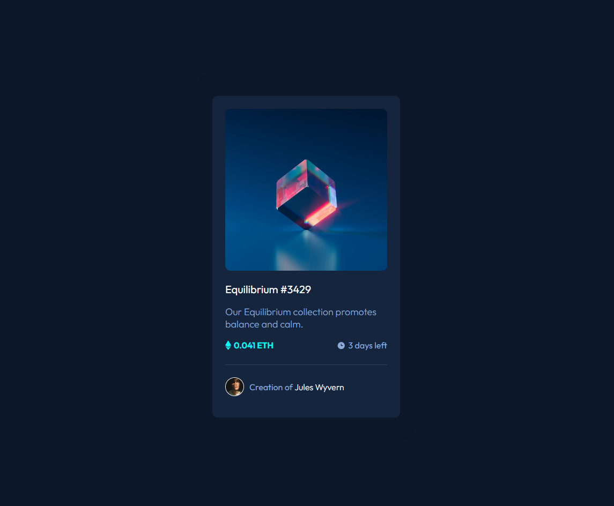

# Frontend Mentor - NFT preview card component solution

This is a solution to the [NFT preview card component challenge on Frontend Mentor](https://www.frontendmentor.io/challenges/nft-preview-card-component-SbdUL_w0U). Frontend Mentor challenges help you improve your coding skills by building realistic projects. 

## Table of contents

- [Overview](#overview)
  - [The challenge](#the-challenge)
  - [Screenshot](#screenshot)
  - [Links](#links)
- [My process](#my-process)
  - [Built with](#built-with)
  - [What I learned](#what-i-learned)
- [Author](#author)

**Note: Delete this note and update the table of contents based on what sections you keep.**

## Overview

### The challenge

Users should be able to:

- View the optimal layout depending on their device's screen size
- See hover states for interactive elements

### Screenshot



### Links

- Live Site URL: [NTF Card](https://banhmisg9509.github.io/frontendmentor-nft-card-sol/)

## My process

### Built with

- HTML5
- CSS custom properties
- Flexbox

### What I learned

Card overlay

```css

.card__header {
  position: relative;
}

.card__header__overlay {
  position: absolute;
  top: 0;
  left: 0;
  width: 100%;
  height: 99%;
  border-radius: 10px;
  background-color: rgb(0, 255, 247, 0.5);
  opacity: 0;
  transition: opacity 0.4s ease;
}

.card__header__overlay img {
  position: absolute;
  top: 50%;
  left: 50%;
  transform: translate(-50%, -50%);
}

.card__header:hover .card__header__overlay {
  opacity: 1;
  cursor: pointer;
}

.card__img {
  width: 100%;
  object-fit: cover;
  border-radius: 10px;
}
```
```html
<div class="card__header">
  
  <div class="card__header__overlay">
    
  </div>
</div>
```
## Author
ndhung

